# Queuectl Backend

**Queuectl** is a Go-based command-line background job queue system that manages job scheduling, worker processing, retries, and failure handling.
It provides a robust, persistent job queue with automatic retry mechanisms, exponential backoff, and a Dead Letter Queue (DLQ) for permanently failed jobs.

This project demonstrates a production-ready architecture for reliable background processing — built for simplicity, concurrency, and transparency.

---

## Table of Contents

1. [Overview](#overview)
2. [Setup Instructions](#setup-instructions)
3. [Usage Examples](#usage-examples)
4. [Architecture Overview](#architecture-overview)
5. [Job Lifecycle](#job-lifecycle)
6. [Assumptions and Trade-offs](#assumptions-and-trade-offs)
7. [Testing Instructions](#testing-instructions)
8. [Folder Structure](#folder-structure)
9. [Future Enhancements](#future-enhancements)
10. [License](#license)

---

## Overview

Queuectl provides a lightweight, persistent job queue with CLI-based management.

Key features include:
- Persistent storage with **SQLite**
- Multiple concurrent **workers**
- **Retry mechanism** with exponential backoff
- **Dead Letter Queue (DLQ)** for permanently failed jobs
- **Job scheduling/delays** using `--delay` or `--run-at`
- **Job priorities** (`--priority` flag)
- Configurable **timeouts** and retry bases
- Simple **web dashboard** for metrics and live monitoring

---

## Setup Instructions

### Prerequisites

- Go **v1.23+**
- SQLite3 installed locally
- Git for cloning the repository

### Clone and Build

```bash
git clone https://github.com/<your-username>/queuectl.backend.git
cd queuectl.backend
go mod tidy
go build -o queuectl
````

### Run the CLI

```bash
./queuectl --help
```


---
### Why Golang
- Golang is one of the fastest working programming languages
- Golang is mainly used for micro-services making it more useful for jobs scheduling and all
- High performance speeds
- is converted to a binary file which can be used anywhere
- Offers faster startups, lesser memory footprints and better concurrency handling compared to the JVM and all.

##  **CLI Commands Reference**

| **Category** | **Command Example** | **Description** |
|---------------|----------------------|------------------|
| **Enqueue** | `queuectl enqueue '{"id":"job1","command":"sleep 2"}'` | Add a new job to the queue |
| **Workers** | `queuectl worker start --count 3` | Start one or more workers |
|              | Press `Ctrl+C` to stop gracefully | Gracefully stop all active workers |
| **Status** | `queuectl status` | Show summary of all job states and active workers |
| **List Jobs** | `queuectl list --state pending` | List jobs by state |
| **DLQ** | `queuectl dlq list` / `queuectl dlq retry job1` | View or retry jobs in the Dead Letter Queue |
| **Stats** | `queuectl stats` | Show aggregated job metrics and performance stats |
| **Config** | `queuectl config set max-retries 3` | View or modify configuration (retry count, backoff, etc.) |
| **Web Dashboard** | `queuectl web` | Start a simple web dashboard for live queue monitoring |


### 1. Enqueue a Job

```bash
go run main.go enqueue '{"command":"echo Hello World"}'
```

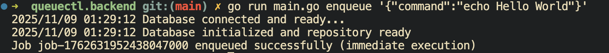

---

### 2. Start Workers

```bash
go run main.go worker start --count 2 --timeout 30s
```

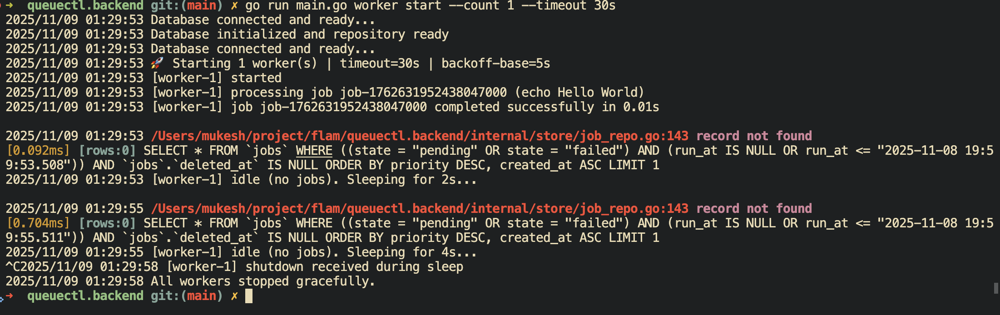

---

### 3. Failed Job and DLQ(Dead Letter Queue)

```bash
go run main.go enqueue '{"command":"exit 1"}'
go run main.go worker start --timeout 5s --backoff-base 2s
go run main.go dlq
```

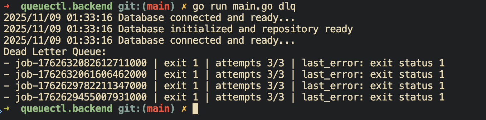

---

### 4. View Job Stats

```bash
go run main.go stats
```

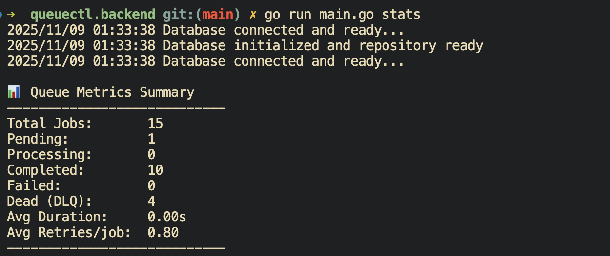

---

### 5. View All Jobs

```bash
go run main.go list
```

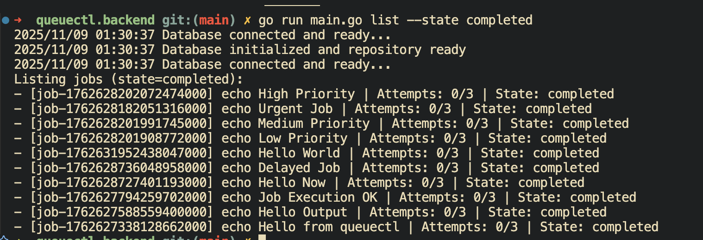

---

### 6. Database Verification

```bash
sqlite3 queue.db "select id, state, attempts, run_at from jobs;"
```

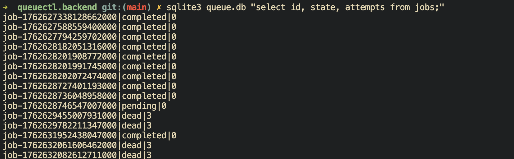

---

### 7. Web Dashboard

```bash
go run main.go web
```

Visit: [http://localhost:8080](http://localhost:8080)

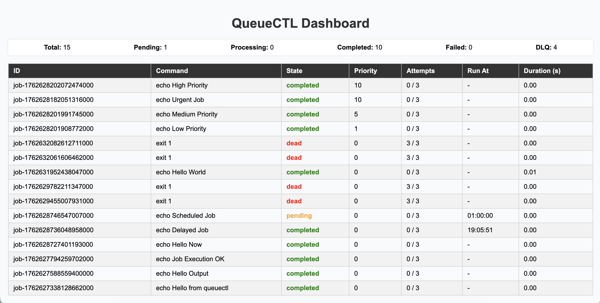

---

## Architecture Overview

Queuectl follows a modular and layered architecture for clarity and scalability:

### 1. CLI Layer (`cmd/`)

Handles all commands, arguments, and user interactions using **Cobra**.

### 2. Storage Layer (`internal/store/`)

Implements persistent job storage in **SQLite** using **GORM ORM**.
Responsible for:

* Job lifecycle management
* Retry and DLQ transitions
* Priority and scheduling logic
#### Job Lifecycle

The **JobRepo** component within the Storage Layer is responsible for maintaining the lifecycle of every job.
Each job progresses through distinct states during its lifetime.

| **State** | **Description** |
|------------|-----------------|
| `pending` | The job has been created and is waiting for a worker to pick it up |
| `processing` | A worker is currently executing the job |
| `completed` | The job has finished successfully |
| `failed` | The job failed but will be retried (until max retries are reached) |
| `dead` | The job has exceeded retry attempts and is moved to the Dead Letter Queue (DLQ) |

This lifecycle is managed by the **store layer**, which updates job states and timestamps after each execution, retry, or failure.

### Implementation Note

In the `store.InitDB()` function, **WAL (Write-Ahead Logging)** mode and a **busy timeout** were enabled to handle concurrent write operations gracefully:

```go
dsn := "queue.db?_journal_mode=WAL&_busy_timeout=5000"
db, err := gorm.Open(sqlite.Open(dsn), &gorm.Config{})
```
This ensures the database can:

- Retry briefly (up to 5 seconds) instead of instantly failing when locked

- Support multiple workers reading simultaneously

- Improve reliability and stability under concurrent workloads

### 3. Worker Layer (`internal/queue/`)

Manages concurrent job execution using goroutines:

* Executes system commands
* Handles retries via exponential backoff
* Implements timeouts
* Supports graceful shutdowns

---

### Job Lifecycle

```
[PENDING] → [PROCESSING] → [COMPLETED]
                     ↓
                 (failure)
                     ↓
               [FAILED] → (retry)
                     ↓
            [DEAD] (after max_retries)
```

---

### Job Structure

```json
{
  "id": "unique-job-id",
  "command": "echo 'Hello World'",
  "state": "pending",
  "attempts": 0,
  "max_retries": 3,
  "created_at": "2025-11-04T10:30:00Z",
  "updated_at": "2025-11-04T10:30:00Z"
}
```

---

## Assumptions and Trade-offs

* **SQLite** chosen for local persistence and simplicity
  (production setups should use PostgreSQL or Redis).
* CLI-first design ensures easy automation and debugging.
* Exponential backoff prevents retry overload.
* Worker coordination is currently **single-node**.
* Shell command execution assumes a trusted environment.
* Configurable retry count, delay, and timeout enhance flexibility.

---

## Testing Instructions
# 1. **Basic Job Completion**
- Command to run
```zsh
go run main.go enqueue '{"command":"echo Hello World"}'
go run main.go worker start --timeout 5s
go run main.go list --state completed
```
output
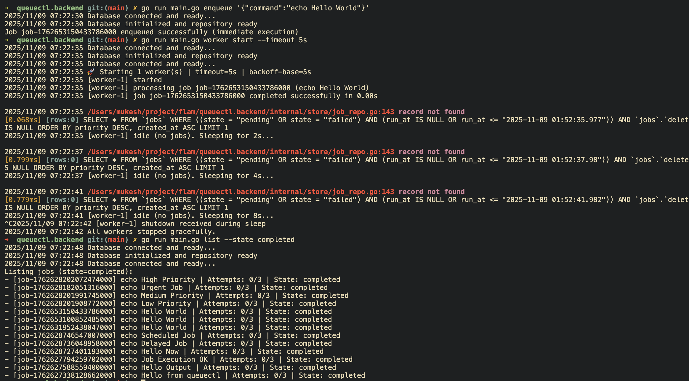

# 2.**Failed Job Retries with Backoff and Moves to DLQ**
```zsh
go run main.go enqueue '{"command":"exit 1"}'
go run main.go worker start --timeout 5s --backoff-base 2s
```
output
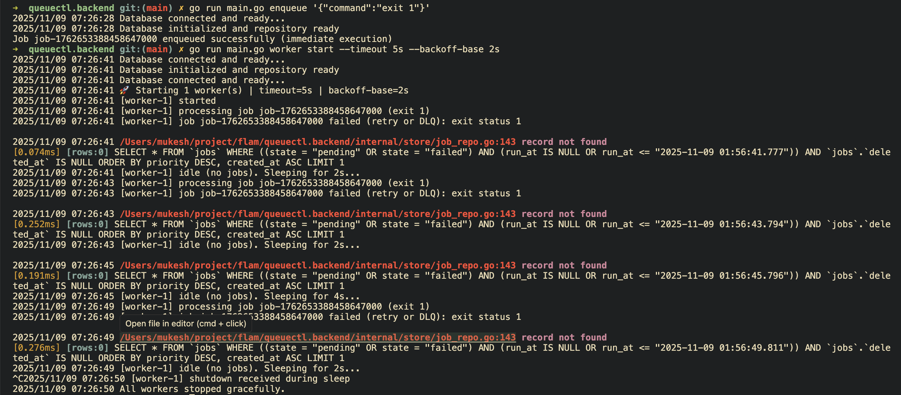

# 3.**Multiple Workers Process Jobs Without Overlap**
```zsh
go run main.go  enqueue '{"command":"echo Job 1"}'
go run main.go enqueue '{"command":"echo Job 2"}'
go run main.go enqueue '{"command":"echo Job 3"}'

# Start the multiple worker processes
go run main.go worker start --count 3 --timeout 10s
```
output
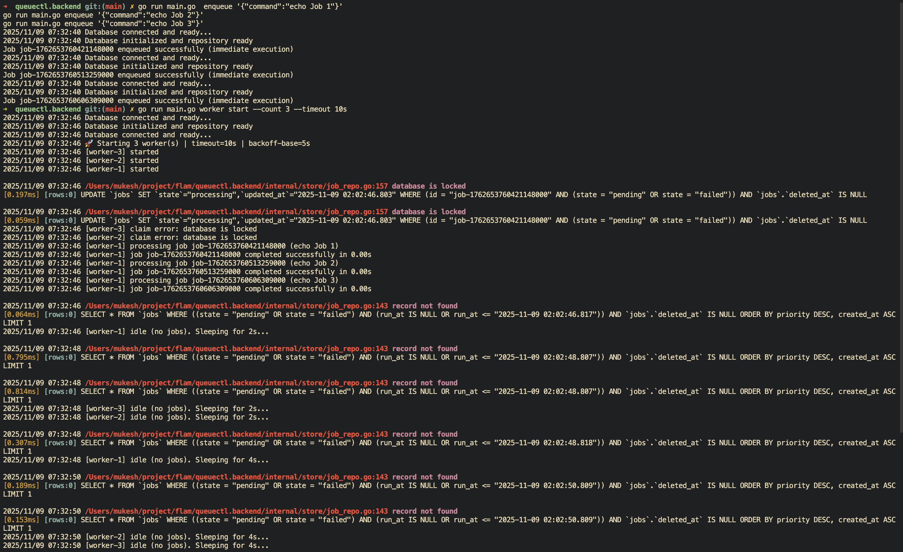

# 4.**Invalid Commands Failure Gracefully**
- **First Enqueue a Job**
```zsh
go run main.go enqueue '{"command":"nonexistentcommand"}'
```
```zsh
go run main.go worker start --timeout 5s --backoff-base 2s
```
**After a few tries this will push it into the Dead Letter Queue(DLQ)**
- check the DLQ
```zsh
go run main.go dlq
```
output
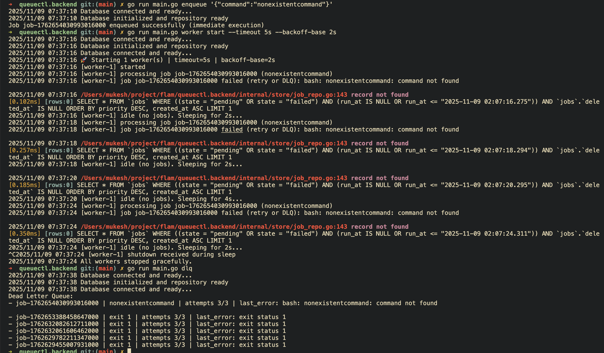

# 5. **Job Data Survives Restart**
- Enqueue a few jobs
```zsh
go run main.go enqueue '{"command":"echo Persisted Job 1"}'
go run main.go enqueue '{"command":"echo Persisted Job 2"}'
```
- Start the worker process
```zsh
go run main.go worker start --timeout 10s
```
- Now restart the process
```zsh
go run main.go list
```
output
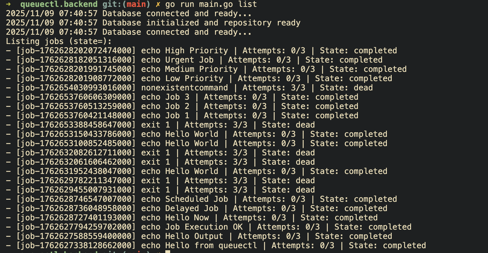
**Job remains the database(queue.db) even after restart**

# 6. **Graceful Shutdown**
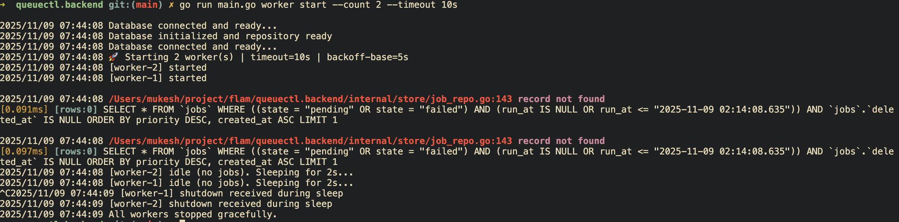
---
## Automated Tests
- Run the build-in Go unit tests to validate repository and job logic:
```zsh
go test ./...
```
Output
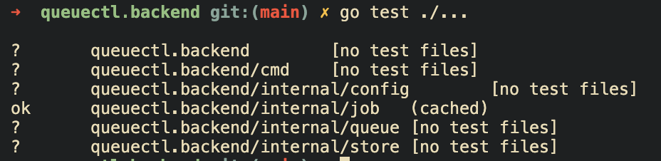

### Shell Script Testing

The project includes an automated shell script to test end-to-end functionality, including job enqueueing, worker execution, retries, and DLQ verification.

> **macOS Users:**
> Install GNU CoreUtils to enable the `timeout` command:
> ```bash
> brew install coreutils
> ```
> The script will automatically detect and use `gtimeout` if available.

> **Windows Users:**
> Run the script using **Git Bash** or **Windows Subsystem for Linux (WSL)** for full compatibility.

> **Linux Users:**
> No additional setup is required — the script works out of the box.

### Run the Script
Execute the end-to-end demo test:

```bash
bash scripts/test_demo.sh
```
output
```zsh
➜  queuectl.backend git:(main) ✗ bash scripts/test_demo.sh

==========================================
  Running Queuectl End-to-End Demo Test
==========================================

[Cleanup] Removing existing queue.db...

[1/5] Enqueueing jobs...
2025/11/09 07:51:16 Database connected and ready...
2025/11/09 07:51:16 Database initialized and repository ready
Job job-1762654876920686000 enqueued successfully (immediate execution)
2025/11/09 07:51:17 Database connected and ready...
2025/11/09 07:51:17 Database initialized and repository ready
Job job-1762654877012472000 enqueued successfully (immediate execution)
2025/11/09 07:51:17 Database connected and ready...
2025/11/09 07:51:17 Database initialized and repository ready
Job job-1762654877106510000 enqueued successfully (immediate execution)

[2/5] Current jobs (should all be pending):
2025/11/09 07:51:18 Database connected and ready...
2025/11/09 07:51:18 Database initialized and repository ready
2025/11/09 07:51:18 Database connected and ready...
Listing jobs (state=):
- [job-1762654877106510000] sleep 1 && echo Job 3 done | Attempts: 0/3 | State: pending
- [job-1762654877012472000] false | Attempts: 0/3 | State: pending
- [job-1762654876920686000] echo Job 1 completed | Attempts: 0/3 | State: pending

[3/5] Starting 2 workers for 10 seconds...
2025/11/09 07:51:19 Database connected and ready...
2025/11/09 07:51:19 Database initialized and repository ready
2025/11/09 07:51:19 Database connected and ready...
2025/11/09 07:51:19 🚀 Starting 2 worker(s) | timeout=5s | backoff-base=5s
2025/11/09 07:51:19 [worker-2] started
2025/11/09 07:51:19 [worker-1] started

2025/11/09 07:51:19 /Users/mukesh/project/flam/queuectl.backend/internal/store/job_repo.go:157 database is locked
[0.026ms] [rows:0] UPDATE `jobs` SET `state`="processing",`updated_at`="2025-11-09 02:21:19.956" WHERE (id = "job-1762654876920686000" AND (state = "pending" OR state = "failed")) AND `jobs`.`deleted_at` IS NULL
2025/11/09 07:51:19 [worker-2] claim error: database is locked
2025/11/09 07:51:19 [worker-1] processing job job-1762654876920686000 (echo Job 1 completed)
2025/11/09 07:51:19 [worker-1] job job-1762654876920686000 completed successfully in 0.00s
2025/11/09 07:51:19 [worker-1] processing job job-1762654877012472000 (false)
2025/11/09 07:51:19 [worker-1] job job-1762654877012472000 failed (retry or DLQ): exit status 1
2025/11/09 07:51:19 [worker-1] processing job job-1762654877106510000 (sleep 1 && echo Job 3 done)
2025/11/09 07:51:20 [worker-1] job job-1762654877106510000 completed successfully in 1.01s

2025/11/09 07:51:20 /Users/mukesh/project/flam/queuectl.backend/internal/store/job_repo.go:143 record not found
[0.334ms] [rows:0] SELECT * FROM `jobs` WHERE ((state = "pending" OR state = "failed") AND (run_at IS NULL OR run_at <= "2025-11-09 02:21:20.977")) AND `jobs`.`deleted_at` IS NULL ORDER BY priority DESC, created_at ASC LIMIT 1
2025/11/09 07:51:20 [worker-1] idle (no jobs). Sleeping for 2s...

2025/11/09 07:51:21 /Users/mukesh/project/flam/queuectl.backend/internal/store/job_repo.go:143 record not found
[0.745ms] [rows:0] SELECT * FROM `jobs` WHERE ((state = "pending" OR state = "failed") AND (run_at IS NULL OR run_at <= "2025-11-09 02:21:21.958")) AND `jobs`.`deleted_at` IS NULL ORDER BY priority DESC, created_at ASC LIMIT 1
2025/11/09 07:51:21 [worker-2] idle (no jobs). Sleeping for 2s...

2025/11/09 07:51:22 /Users/mukesh/project/flam/queuectl.backend/internal/store/job_repo.go:143 record not found
[0.821ms] [rows:0] SELECT * FROM `jobs` WHERE ((state = "pending" OR state = "failed") AND (run_at IS NULL OR run_at <= "2025-11-09 02:21:22.979")) AND `jobs`.`deleted_at` IS NULL ORDER BY priority DESC, created_at ASC LIMIT 1
2025/11/09 07:51:22 [worker-1] idle (no jobs). Sleeping for 4s...
^C
2025/11/09 07:51:23 /Users/mukesh/project/flam/queuectl.backend/internal/store/job_repo.go:143 record not found
[0.665ms] [rows:0] SELECT * FROM `jobs` WHERE ((state = "pending" OR state = "failed") AND (run_at IS NULL OR run_at <= "2025-11-09 02:21:23.961")) AND `jobs`.`deleted_at` IS NULL ORDER BY priority DESC, created_at ASC LIMIT 1
2025/11/09 07:51:23 [worker-2] idle (no jobs). Sleeping for 4s...
^C^C^C2025/11/09 07:51:26 [worker-1] processing job job-1762654877012472000 (false)
2025/11/09 07:51:26 [worker-1] job job-1762654877012472000 failed (retry or DLQ): exit status 1

2025/11/09 07:51:26 /Users/mukesh/project/flam/queuectl.backend/internal/store/job_repo.go:143 record not found
[0.427ms] [rows:0] SELECT * FROM `jobs` WHERE ((state = "pending" OR state = "failed") AND (run_at IS NULL OR run_at <= "2025-11-09 02:21:26.995")) AND `jobs`.`deleted_at` IS NULL ORDER BY priority DESC, created_at ASC LIMIT 1
2025/11/09 07:51:26 [worker-1] idle (no jobs). Sleeping for 2s...
^C^C^C
2025/11/09 07:51:27 /Users/mukesh/project/flam/queuectl.backend/internal/store/job_repo.go:143 record not found
[0.778ms] [rows:0] SELECT * FROM `jobs` WHERE ((state = "pending" OR state = "failed") AND (run_at IS NULL OR run_at <= "2025-11-09 02:21:27.963")) AND `jobs`.`deleted_at` IS NULL ORDER BY priority DESC, created_at ASC LIMIT 1
2025/11/09 07:51:27 [worker-2] idle (no jobs). Sleeping for 8s...
^C
2025/11/09 07:51:28 /Users/mukesh/project/flam/queuectl.backend/internal/store/job_repo.go:143 record not found
[0.650ms] [rows:0] SELECT * FROM `jobs` WHERE ((state = "pending" OR state = "failed") AND (run_at IS NULL OR run_at <= "2025-11-09 02:21:28.997")) AND `jobs`.`deleted_at` IS NULL ORDER BY priority DESC, created_at ASC LIMIT 1
2025/11/09 07:51:28 [worker-1] idle (no jobs). Sleeping for 4s...

[4/5] Checking job status:
2025/11/09 07:51:30 Database connected and ready...
2025/11/09 07:51:30 Database initialized and repository ready
Job Queue Status:
Total Jobs: 3
Pending: 0
Processing: 0
Completed: 2
Failed: 1
Dead (DLQ): 0

[5/5] Dead Letter Queue:
2025/11/09 07:51:32 Database connected and ready...
2025/11/09 07:51:32 Database initialized and repository ready
2025/11/09 07:51:32 Database connected and ready...
DLQ is empty

==========================================
 End-to-End Demo Test Complete!
==========================================
```

## Folder Structure

```
.
├── DESIGN.md
├── LICENSE
├── README.md
├── cmd
│   ├── common.go
│   ├── config.go
│   ├── dlq.go
│   ├── enqueue.go
│   ├── list.go
│   ├── root.go
│   ├── stats.go
│   ├── status.go
│   ├── web.go
│   └── worker.go
├── go.mod
├── go.sum
├── internal
│   ├── config
│   │   └── model.go
│   ├── job
│   │   ├── job_test.go
│   │   ├── model.go
│   │   └── queue.db
│   ├── queue
│   │   ├── executor.go
│   │   └── worker.go
│   └── store
│       ├── job_repo.go
│       └── store.go
├── main.go
├── output
│   ├── dlq.png
│   ├── enqueue_success.png
│   ├── go_test.png
│   ├── list_completed.png
│   ├── output.png
│   ├── sql.png
│   ├── stats.png
│   ├── test.png
│   ├── web.png
│   └── worker_success.png
├── queue.db
└── scripts
    └── test_demo.sh
```

---

## Future Enhancements
* Migration from SQLite to Postgres or Redis for faster distributed
* Distributed worker coordination
* REST API for remote management
* WebSocket live updates for dashboard
* Role-based access control
* Pause/resume job support
* Integration with message queues (RabbitMQ, Kafka)

---
**For Design Updates:**
_See [DESIGN.md](./DESIGN.md) for deeper architectural details._

## License

This project is licensed under the **MIT License**.
See the [LICENSE](LICENSE) file for details.


